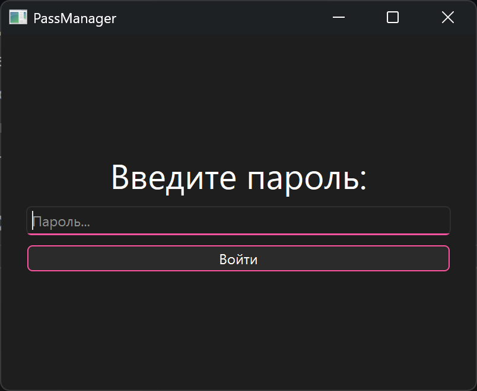
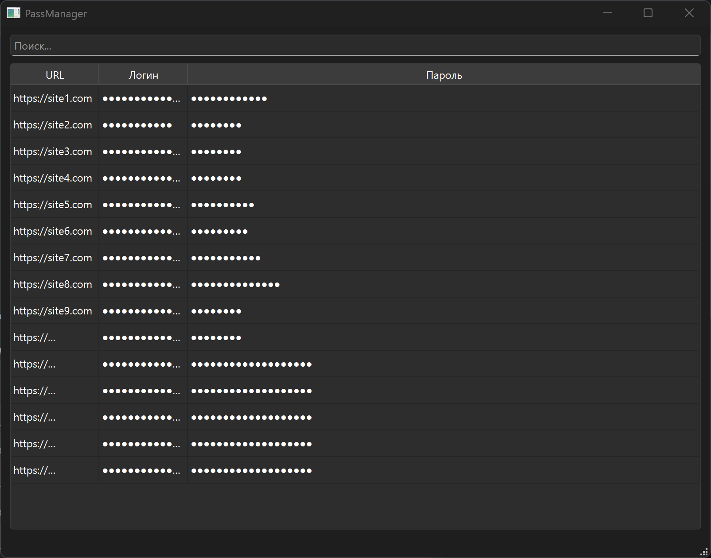
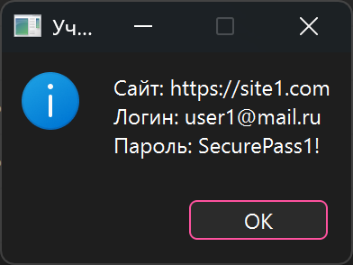

# Лабораторная работа 1: Безопасное хранение паролей

## Описание

В проекте реализовано приложение для безопасного хранения учётных данных с использованием двухслойного шифрования AES-256. В нем предусмотрены различные методы защиты данных:

* **Двухслойное шифрование AES-256**.
* **Защита файла с данными** от несанкционированного доступа.
* **Хранение ключей шифрования в оперативной памяти** с последующим затиранием.
* **Проверка целостности исполняемого файла** через хеширование секции кода.
* **Обнаружение отладчиков и модификации приложения**.
* **Защита от дампа оперативной памяти**.

## Скриншоты работы приложения

* **Рисунок 1**: Окно ввода мастер-пароля

  * *Описание*: Ввод мастер-пароля для доступа к данным.

  

* **Рисунок 2**: Основное окно со списком учётных данных

  * *Описание*: Отображение списка учётных данных.

  

* **Рисунок 3**: Расшифровка учётной записи

  * *Описание*: Окно с подробной информацией о выбранной учётной записи.

  

## Инструкция по сборке

1. Установите **Qt 6.5 или выше**.
2. Установите **OpenSSL** (для Windows: OpenSSL-Win64).
3. Откройте **CMakeLists.txt** в **Qt Creator**.
4. Настройте пути к OpenSSL в **CMakeLists.txt**.
5. Соберите проект (Ctrl+B).
6. Поместите файл **value.enc** в директорию со сборкой.
7. Запустите приложение.

